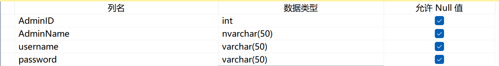
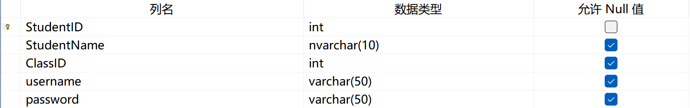
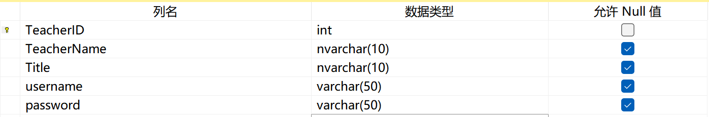
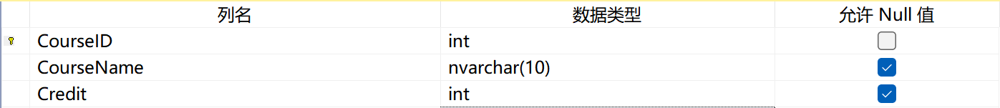
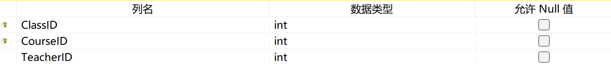
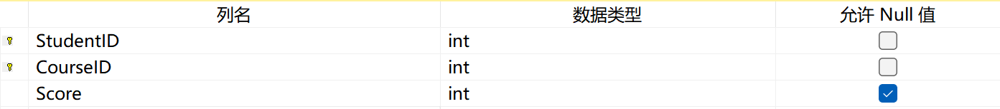

# **1.环境准备**
**Python 安装**: 确保系统已安装 Python，建议使用 Python 3.x 版本。

**安装 PyQt5**: 运行以下命令以安装 PyQt5：

`pip install PyQt5`

**安装 pymssql**: 运行以下命令以安装 pymssql：
`
pip install pymssql`

# 2. 数据库准备

**数据库服务器**: 
确保数据库服务器（如 Microsoft SQL Server）已经安装并正在运行。

**创建数据库**: 
根据代码中的 数据库='学生成绩管理'（也可以取别的名字，只是连接数据库时需要修改相应的名字），确保在数据库服务器上创建该数据库。
不同主机运行，数据库服务地址也需要修改

`def get_db_connection():
    """创建并返回数据库连接的函数。"""
    try:
        connection = pymssql.connect(
            server='YOUR_SERVER',  # 数据库服务地址（如果不知道地址可往下翻，提供了获取地址的方法），例如 'localhost' 或 'LAPTOP-2UJ543GH\\NEWEST'
            user='YOUR_USERNAME',  # 数据库用户名 如果无需验证直接连接数据库该行删除
            password='YOUR_PASSWORD',  # 数据库密码  如果无需验证直接连接数据库该行删除
            database='YOUR_DATABASE'  # 数据库名称
        )
        print("数据库连接成功")
        return connection
    except pymssql.DatabaseError as e:
        print(f"数据库连接错误: {e}")
        return None`

**查找数据库服务地址**：
（只针对SQL Server）
使用 SQL Server Management Studio (SSMS):

打开 SSMS。
如果能够再次连接到服务器，可以在连接对话框中找到服务器名称。
连接后，可以通过查询：

`SELECT SERVERPROPERTY('MachineName') AS ServerName;
SELECT SERVERPROPERTY('InstanceName') AS InstanceName;`

这样的 SQL 查询可以帮助您获取更详细的服务器信息。

查看配置: SQL Server 配置管理器中也可以查看服务器的网络配置，找到用于接受连接的 IP 地址

**创建表及数据结构**:
创建 Students, Teachers, Admins, Courses, Classes, Grades 等表，字段应与代码中查询和操作相匹配。

在这些表中插入一些测试数据，以便于进行登录和功能测试。

Admins表：

Students表：

Teachers表：

Courses表：

Classes表：

Grades表：

